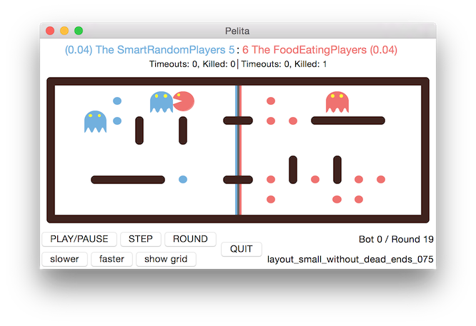

# Pelita

## Description

Pelita is a programmable game that lets you play against your opponent by writing code in Python.

## Website

Current, up-to-date documentation and templates for your own code can be found on: https://github.com/ASPP/pelita_template

## Development

Pelita uses GitHub for development and bug tracking. Feel encouraged to open an issue or create a pull request.

