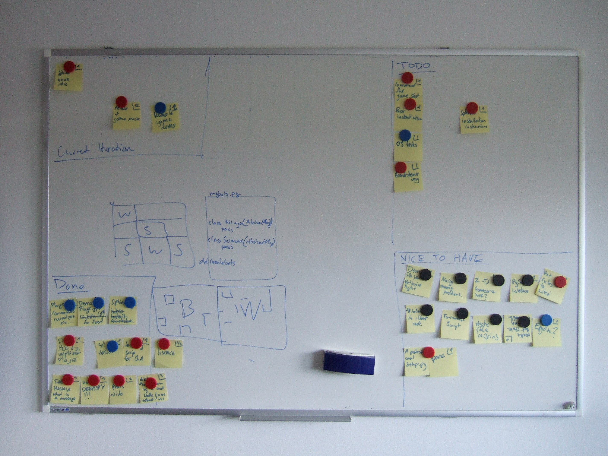
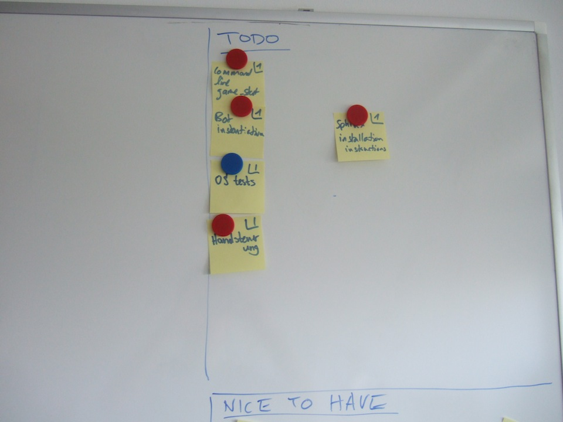
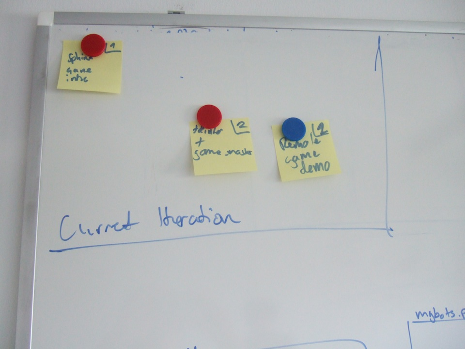
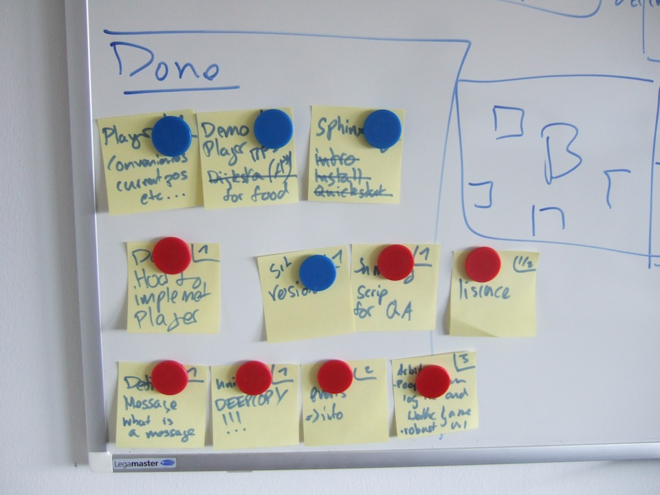
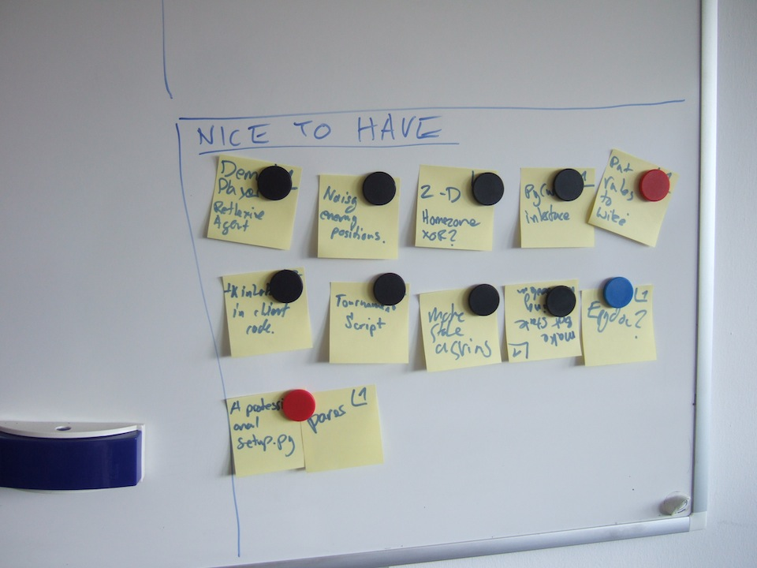

===========
Development
===========

This section contains information for developers of Pelita.

Git-Repository
==============

The official Git-Repository is hosted at Github:
`https://github.com/Debilski/pelita <https://github.com/Debilski/pelita>`_

You can create a clone with::

    $ git clone git://github.com/Debilski/pelita.git

Project Website
===============

We use the `Sphinx Tool <http://sphinx.pocoo.org/>`_ to generate the project
website and `GitHub pages <http://pages.github.com/>`_ to host it.

This means that the content generated by sphynx is kept in a separate branch in the
source code repository called ``gh-pages`` (`gh-pages branch for Pelita
<https://github.com/Debilski/pelita/commits/gh-pages>`_). This branch has its
own root commit and is hence disconnected from the commits that track the
project code as well as the documentation source code.

When this branch is pushed to GitHub the contained documentation is
automatically deployed to the web server. There are two ways to make commits to
the ``gh-pages`` branch: using a script or through a series of git
command lines.
Initially we used the manual commands, and then these were then
converted into a script. Unfortunately, the script
was subsequently upgraded multiple times and hence the manual commands and
the script are completely out of sync. As a consequence, the command listing is only
provided as a reference and **all website updates should be performed
using the script**.

Automatic
---------

Use the `commit-tree-doc.sh script
<https://github.com/Debilski/pelita/blob/develop/commit-doc-tree.sh>`_.  This
will automatically make the commit of the latest version of the documentation on
the ``gh-pages`` branch. After checking that everything is in order you still need
to push that branch.

Run the script::

    $ ./commit-doc-tree.sh
    Generating doc from v0.1.0-rc1-165-g3d353c9
    ...
    Build finished. The HTML pages are in build/html.
    Switched to branch 'gh-pages'
    Your branch is ahead of 'origin/gh-pages' by 1 commit.
    ce78099 DOC: Sphinx generated doc from v0.1.0-rc1-165-g3d353c9

Examine the output closely and if all went well::

    $ git push

And get back to work::

    $ git co -

Manual
------

Move to the ``doc`` directory::

    $ cd doc

Edit the documentation::

    $ vim source/<file>.rst

Generate html::

    $ make html

Switch to the documentation branch::

    $ git checkout gh-pages

Move back up to the root directory::

    $ cd ..

Copy the generate documentation here::

    $ cp -r doc/build/html/* .

Add all tracked files that have been changed::

    $ git add -u

Add possibly new files::

    $ git add <new pages>.html

Make a commit message where ``XXXXXXX`` is the SHA-1
prefix of the commit the documentation was # generated from::

    $ git commit -m "sphinx generated doc from XXXXXXX"

Project-Wall
============

We used an agile project wall to track tasks for the initial stages of the
development. In our case we split it into four distinct sections: ``todo``
(upper right), ``current iteration`` (upper left), ``done`` (lower left) and
``nice to have`` (lower right). Since we only had one whiteboard we kept the
center for sketches and doodles.  You can read about the agile project wall in
the book: `The Agile Samurai
<http://pragprog.com/book/jtrap/the-agile-samurai>`_ by Jonathan Rasmusson

Here are some photos:

   The whole wall

   The 'todo' section

   The 'current' section

   The 'done' section

   The 'nice to have' section
