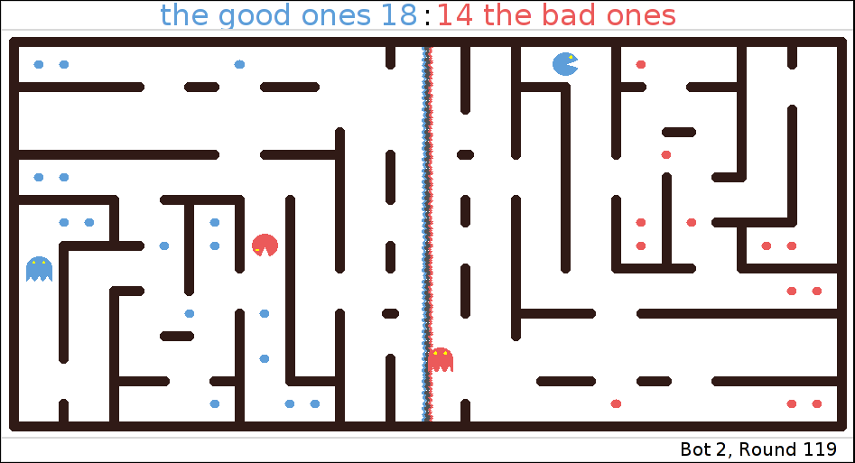

.. Pelita documentation master file, created by
   sphinx-quickstart on Mon Jul 18 14:32:16 2011.
   You can adapt this file completely to your liking, but it should at least
   contain the root `toctree` directive.

======
Pelita
======

   **A first fight:** 'the bad ones' VS. 'the good ones'

**Pelita** is Actor-based Toolkit for Interactive Language Education in Python.

Description of the Game
=======================

Two teams of one or more *bots* compete in a *maze* that is filled with *food*.
The maze is split into two parts, the left and the right half, where each team
*owns* one half of the maze.  Each bot can have one of two states, depending on
its position in the maze. In its own half the bot is a *destroyer*. In the
enemy half, the bot is a *harvester*. As a destroyer a bot can *destroy* enemy
harvesters in its own half. As a harvester a bot can *eat* food that belongs to
the enemy. The ultimate goal is to eat all the enemy's food.

Your task as *user* is to implement one or more *players* to control bots. Your
players must implement the *intelligence* to navigate you bots successfully
through the maze, destroy the enemy's harvesters and eat the enemy's food.

Quick Start
===========

First clone the source code repository::

    $ git clone git://github.com/Debilski/pelita.git

And launch the command-line interface::

    $ ~/pelita/pelitagame

This will start a demo game using the `TkInter
<http://wiki.python.org/moin/TkInter>`_ interface on a random maze
with some predefined players.

Continue reading: :ref:`writing_a_player`.

Contents:

.. toctree::
   :maxdepth: 2

   info
   writing_player
   running_player
   development
   api

Indices and tables
==================

* :ref:`genindex`
* :ref:`modindex`
* :ref:`search`
