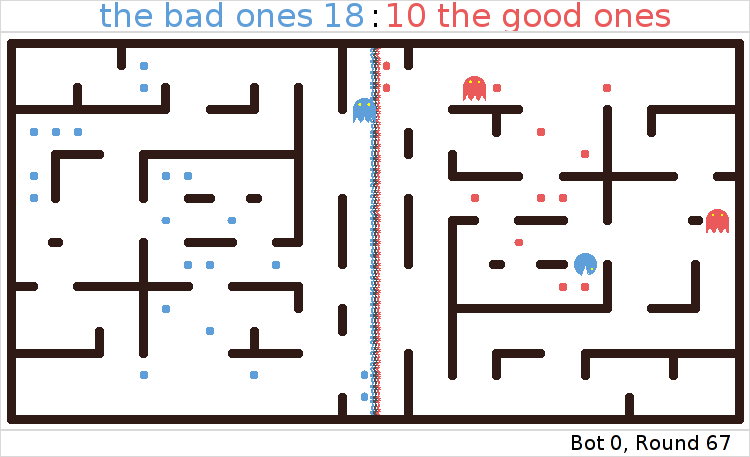

.. Pelita documentation master file, created by
   sphinx-quickstart on Mon Jul 18 14:32:16 2011.
   You can adapt this file completely to your liking, but it should at least
   contain the root `toctree` directive.

======
Pelita
======

   **A first fight:** 'the bad ones' VS. 'the good ones'

**Pelita** is an artificial intelligence programming game in Python, based
loosely on Pacman.

Description of the game
=======================

Two teams of one or more *bots* compete in a *maze* that is filled with *food*.
The maze is split into two parts, the left and the right half, where each team
*owns* one half of the maze.  Each bot can have one of two states, depending on
its position in the maze. In its own half the bot is a *destroyer*. In the
enemy half, the bot is a *harvester*. As a destroyer a bot can *destroy* enemy
harvesters in its own half. As a harvester a bot can *eat* food that belongs to
the enemy. The ultimate goal is to eat all the enemy's food.

Your task as *user* is to implement one or more *players* to control bots. Your
players must implement the *intelligence* to navigate you bots successfully
through the maze, destroy the enemy's harvesters and eat the enemy's food.

Quick Start
===========

First clone the source code repository::

    $ git clone git://github.com/Debilski/pelita.git

Then ``cd`` into the source code directory::

    $ cd pelita

And launch the demo game::

    $ python demo.py

This will start a game using the `TkInter
<http://wiki.python.org/moin/TkInter>`_ interface using a random maze.

Contents:

.. toctree::
   :maxdepth: 1

   writing_player
   development

Authors and Contributors
========================

The developers are:

* Rike-Benjamin Schuppner
* Valentin Haenel
* Tiziano Zito

With helpful contributions by:

* Zbigniew Jędrzejewski-Szmek
* Pietro Berkes

Getting in Touch
================

Please use our `project mailinglist
<https://portal.bccn-berlin.de/cgi-bin/mailman/listinfo/pelita>`_ for questions
and discussion. Use the `GitHub issues page
<https://github.com/Debilski/pelita/issues>`_ to report bugs.

License
=======

Pelita is licensed under the terms of the `Simplified (two-clause) BSD License
<http://en.wikipedia.org/wiki/BSD_licenses#2-clause_license_.28.22Simplified_BSD_License.22_or_.22FreeBSD_License.22.29>`_.
A copy of the license is included with the source, in the file ``COPYING``.

Acknowledgements
================

The game is inspired by the `“Pac-Man Projects”
<http://inst.eecs.berkeley.edu/~cs188/pacman/pacman.html>`_  developed by John
DeNero and Dan Klein at Berkeley University for their artificial intelligence
introductory course [DeNeroKlein]_.

This software was developed for the “Advanced Scientific Programming in Python”
summer school, as a teaching aid for the group project.

Future:

* `St Andrews, Scotland, 2011 <https://python.g-node.org/wiki/>`_

Past:

* `Trento, Italy, 2010 <https://python.g-node.org/python-autumnschool-2010/>`_
* `Warsaw, Poland, 2010 <http://escher.fuw.edu.pl/pythonschool/>`_
* `Berlin, Germany, 2009 <http://portal.g-node.org/python-summerschool-2009/>`_

Initial funding was kindly provided by `The German Neuroinformtaics Node
<http://www.g-node.org/>`_.

Indices and tables
==================

* :ref:`genindex`
* :ref:`modindex`
* :ref:`search`

References
==========

.. [DeNeroKlein] John DeNero and Dan Klein. Teaching Introductory Artificial
   Intelligence with Pac-Man. In *proceedings of the Symposium on Educational
   Advances in Artificial Intelligence (EAAI)*, 2010.
   `pdf <http://www.denero.org/content/pubs/eaai10_denero_pacman.pdf>`_
