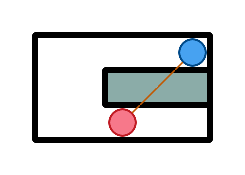
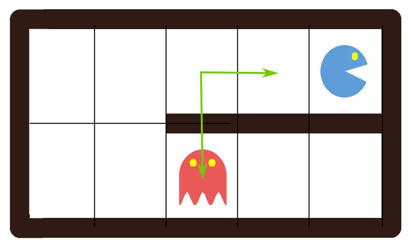
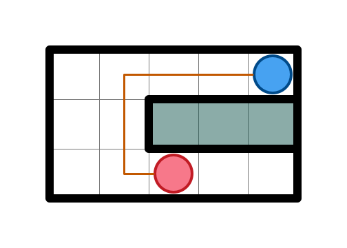

.. _writing_a_player:

================
Writing a Player
================

This section explains how to write a player.

.. contents::

Introduction
============

To begin with, we must define a few classes and some terminology which will be
used throughout this documentation.

`pelita.datamodel.CTFUniverse`:
    The game state. Holds a list of ``Bot`` instances, a list of ``Team``
    instances and a single ``Maze`` object. Can be queried to obtain
    information about the game.

`pelita.datamodel.Bot`:
    The data structure used to store the bot. This holds the position of the
    ``Bot`` inside the Maze, its initial position, which team it belongs to
    etc..

`pelita.datamodel.Team`:
    In capture-the-flag each ``Bot`` belongs to a ``Team``. The team stores the
    indices of its bot, the score, the team name etc..

`pelita.datamodel.Maze`:
    Data structure that stores the maze or layout, i.e. where walls and food
    are.

`pelita.game_master.GameMaster`:
    Controller object that asks players for moves and updates the ``Universe``.
    You will never need to interact with this object but it's good to know that
    this is the central object that coordinates the game.

In addition to these classes there are two additional relevant concepts:

:``Player``:
    Your implementation of the *intelligence* for a ``Bot``. The abstraction is
    that a *player* object controls a *bot* object.

:``move``:
    A tuple that indicates where a ``Bot`` should move.

Player Basics
=============

In order to write a player you should subclass from
`pelita.player.AbstractPlayer`. This is an abstract class which provides
several convenience methods and properties to interrogate the universe
including the bot instance that this player controls, but lacks the functions
to actually control the bot.

To subclass from ``AbstractPlayer`` import this with::

    from pelita.player import AbstractPlayer

In order to make your player do something useful you must implement at least the
method ``get_move()`` to return a move. This can be one of::

    (north, south, west, east, stop)

The moves are provided by the `pelita.datamodel`, import them with::

    from pelita.datamodel import north, south, west, east, stop

An example of such a player is the trivial `pelita.player.StoppingPlayer`
which simply returns ``stop``:

.. literalinclude:: ../../pelita/player.py
   :pyobject: StoppingPlayer

.. note::

    Besides the definition of your player, this file must contain a factory
    function that returns a team (remember that the default game is a
    fight between two teams of two bots each)::

        def factory():
            return SimpleTeam("MyTeam", StoppingPlayer(), StoppingPlayer())

    For more information about this, see also::doc:`running_player`

Note: the current state or the ``CTFUniverse`` is always implicitly available
via the ``current_uni`` property inherited from ``AbstractPlayer``. But more
about that later.

Doing More
==========

A slightly more useful example is the `pelita.player.RandomPlayer` which always
selects a move at random from the possible moves:

.. literalinclude:: ../../pelita/player.py
   :pyobject: RandomPlayer

.. note::

    To make the above example (and many of the following examples)work, it
    might be necessary to add appropriate imports to your python source file,
    for example::

        from pelita.player import AbstractPlayer
        from pelita.datamodel import north, south, west, east, stop

Here we can see the first convenience property ``legal_moves`` which returns a
dictionary mapping move tuples to position tuples. The random player simply
selects a move at random from the keys (moves) of this dictionary and then
moves there. ``legal_moves`` always includes stop.

The next example is the not-quite random player
``pelita.player.NQRandomPlayer``.  This one does not move back to the position
where it was on its last turn and never stops in place:

.. literalinclude:: ../../pelita/player.py
   :pyobject: NQRandomPlayer

Here we can see the use of another convenience method: ``previous_pos`` which
gives the position the bot had in the previous round.

The Maze Coordinate System
==========================

The coordinate system is the standard coordinate system used in computer games.
``x`` increases to the left, and ``y`` increases downwards, and a position is
encoded as the tuple ``(x, y)``. There are no negative coordinates. The
following example illustrates this for a few positions:

    +---------+---------+---------+---------+---------+
    | (0, 0)  | (1, 0)  | (2, 0)  | (3, 0)  | ...     |
    +---------+---------+---------+---------+---------+
    | (0, 1)  | (1, 1)  | (2, 1)  | (3, 1)  | ...     |
    +---------+---------+---------+---------+---------+
    | (0, 2)  | (1, 2)  | (2, 2)  | (3, 2)  | ...     |
    +---------+---------+---------+---------+---------+
    | ...     | ...     | ...     | ...     | ...     |
    +---------+---------+---------+---------+---------+

As a result we obtain the following direction vectors::

    north = (0, -1)
    south = (0, 1)
    west  = (-1, 0)
    east  = (1, 0)
    stop  = (0, 0)

Distances in the Maze
---------------------

There are different ways of measuring distances between objects in the maze. 
The `Euclidean distance <http://en.wikipedia.org/wiki/Euclidean_distance>`_
is the length of the vector connecting the centers
of the cells where the objects are located:

   **Euclidean distance:** The Euclidean distance between the two bots is 
   sqrt((x1-x2)**2 + (y1-y2)**2) = sqrt((4.5-2.5)**2+(0.5-1.5)**2) = 2.236...

The `Manhattan distance <http://en.wikipedia.org/wiki/Taxicab_geometry>`_,
also known as L1-distance or taxicab-distance, is the
absolute difference of the coordinates of the two objects: 

   **Manhattan distance:** The Manhattan distance between the two bots is 
   abs(x1-x2) + abs(y1-y2) = abs(4-2) + abs(0-1) = 3

The maze distance counts the number of cells of the shortest path that
connects the two objects:

   **Maze distance:** The Maze distance between the two bots is 5.

Note that Manhattan and maze distances are always integer values.
In the game, distances are almost always measured either in Manhattan or in 
maze distance.
We provide a series of convenience methods for dealing with position 
and distances in `pelita.datamodel`:

.. currentmodule:: pelita.datamodel

.. autosummary::
   :nosignatures:

    new_pos
    diff_pos
    is_adjacent
    manhattan_dist

A Basic Offensive Player
========================

A somewhat more elaborate example is the `pelita.player.BFSPlayer` which uses
*breadth first search* on an *adjacency list* representation of the maze to
find food:

.. literalinclude:: ../../pelita/player.py
   :pyobject: BFSPlayer

This next sections will explore the convenience properties of the
``AbstractPlayer`` as used in the ``BFSPlayer``.

``current_uni``, ``current_pos`` and ``enemy_food``
---------------------------------------------------

The ``BFSPlayer`` makes use of some more advanced concepts. The first thing to
note is that any player can override the method ``set_initial()``. At this
stage food is still present, and all bots are at their initial position. In the
above example we initialise the adjacency list representation of the maze. As
mentioned previously the current state of the universe is always available as
``current_uni``. Within ``set_initial()`` this is the starting state.

The next interesting thing to look at is the ``bfs_food()`` method which simply
searches the ``AdjacencyList`` to find the closest food and returns a path to
that food. In the process it makes use of two convenience properties:
``current_pos`` and ``enemy_food``. The first is the location of the ``Bot``
controlled by this ``Player`` as a position tuple. The second is a list of
position tuples of the food owned by the enemy (which can be eaten by this
bot).

There are a few more convenience properties available from ``AbstractPlayer``,
you should look at the section :ref:`user_api_reference` for details.

Recovery Strategies in Case of Death or Timeout
-----------------------------------------------

Lastly, we are going to see some error recovery code in the
``get_move()`` method of the ``BFSPlayer``.

The ``BFSPlayer`` is sometimes killed, as expected for an offensive player. In
order to detect this, it's best to compare the current position with its
initial position using the ``initial_pos`` convenience property, since this is
where it will respawn.

Your player only has a limited time to return from ``get_move()``. The default
is approximately three seconds. If your player does not respond in time, the
``GameMaster`` will move the bot at random for this turn. It's important to
recover from such an event. The ``BFSPlayer`` does this by catching the
``ValueError`` raised by ``diff_pos``.

The main problem with detecting a timeout is that, as long as your
computationally expensive process is running, there is no way to interrupt it.
Imagine an infinite ``for`` loop in your ``get_move()``::

    while True:
        pass

In this case, your ``get_move()`` will be executed exactly once! Thus it is
important to ensure that your search algorithms are efficient and fast.

.. TODO: when one bot blocks, the whole team blocks
.. TODO: how to be notified when a timeout happened.
.. TODO: the universe states will be missing a state

Interacting with the Maze
=========================

The ``BFSPlayer`` above uses the adjacency list representation provided by:
`pelita.graph.AdjacencyList``. Let's have a quick look at how this is
generated, in case you would like to implement your own `graph storage
<http://en.wikipedia.org/wiki/Graph_(data_structure)>`_ or leverage an
alternative existing package such as `NetworkX <http://networkx.lanl.gov/>`_.

Here it is the ``__init__`` of the ``AdjacencyList``:

.. literalinclude:: ../../pelita/graph.py
   :lines: 17-30

In order to obtain the positions of all free spaces, the
`pelita.datamodel.Maze` class provides the function
`pelita.datamodel.Maze.pos_of`. A maze can hold three different components at
each position, all of them available in ``pelita.datamodel``: ``Wall``,
``Free``, ``Food``. We thus can get a list of all positions by calling::

    maze.pos_of(Free)

Then, we use the method ``get_legal_moves(pos).values()`` to obtain the
adjacent free spaces, for each of the free positions.  The last step is to use
the ``update`` method to set the generated dictionary, which we can do, since
``AdjacencyList`` inherits from ``dict``.

In addition to ``pos_of``, there are a few additional constructs that are
useful when dealing with the maze. The property ``positions`` gives all the
positions in the maze. To check if a given maze component is at a certain
position use the ``in`` operator::

    Free in maze[2, 3]

Sometimes, when exploring future states of the universe, you may want to add or
remove food to the maze::

    # removing items
    maze.remove_at(Food, (2,3))
    # adding items
    stuff = maze[2,3]
    stuff.append(Food)
    maze[0,1] = stuff

A Basic Defensive Player
========================

As a defensive example we have the ``BasicDefensePlayer``:

.. literalinclude:: ../../pelita/player.py
   :pyobject: BasicDefensePlayer

Defense is important because your enemy is awarded ``5`` points if he
manages to destroy one of your bots!

The player mostly uses convenience properties already introduced for the
``BFSPlayer`` in addition to a few others. For example ``path_to_border`` uses
the ``team_border`` convenience property which gives the positions of the
border. Also, ``get_move()`` access the ``enemy_bots`` property and then uses
the ``team.in_zone(position)`` function to check if an enemy position is within
the zone of this team. Note that ``team`` is a convenience property of the
``AbstractPlayer`` which in turn gives access to the ``Team`` instance from the
``CTFUniverse``, which in turn has the method ``in_zone(position)``.

For a comprehensive overview of all the properties of ``AbstractPlayer``,
look at the section :ref:`user_api_reference`.

Note that this player simply ignores the noisy enemy positions (described
next).

Noisy Enemy Positions
=====================

In general, the ``CTFUniverse`` you receive is noisy. This means that you can
only obtain an accurate fix on the enemy bots if they are within 5 squares maze
distance (otherwise, the position is noisy with a uniform radius of 5 squares
maze distance). These two values may lead to confusing values: for example if
the bot is 6 squares away, but the added noise of 4 squares towards your bot,
make it appear as if it were only 2 squares away. Thus, you can check if a bot
position is noisy using the ``noisy`` attribute of the bot instance, in
combination with the ``enemy_bots`` convenience property provided by
``AbstractPlayer``::

    self.enemy_bots[0].noisy

One idea is to implement probabilistic tracking using a `Kalman filter
<http://en.wikipedia.org/wiki/Kalman_filter>`_

If you wish to know how the noise is implemented, look at the class:
``pelita.game_master.UniverseNoiser``.

Implementation Details of Convenience Properties
================================================

This section contains some details about the implementation of the convenience
properties of ``AbstractPlayer``. Reading this section is not required, but may
be of interest to the curious reader.

Let's take a quick look as the implementation
of ``current_uni``:

.. literalinclude:: ../../pelita/player.py
   :pyobject: AbstractPlayer.current_uni

Importantly we see that the ``AbstractPlayer`` automatically maintains a stack
of previous states of the Universe called ``universe_states``.
As we can see ``current_uni`` is simply the top element of this stack. This
allows us to access the properties and methods of the ``CTFUniverse``, for
example look at the implementation of ``legal_moves``:

.. literalinclude:: ../../pelita/player.py
   :pyobject: AbstractPlayer.legal_moves

Here we can see that this simply calls the method ``get_legal_moves(pos)``
which is provided by ``CTFUniverse``. We also see one of the convenience
properties used in the ``bfs_food()`` method: ``current_pos`` which returns the
current position of the bot.  Let's have a look at this:

.. literalinclude:: ../../pelita/player.py
   :pyobject: AbstractPlayer.current_pos

We see that this makes use of the ``me`` property which is defined as follows:

.. literalinclude:: ../../pelita/player.py
   :pyobject: AbstractPlayer.me

As you can see, ``me`` will simply obtain the ``Bot`` instance controlled by
this player from the current universe using the hidden ``_index`` attribute of
the player. In practice, you should be able to avoid having to use the
``_index`` directly but it's good to know how this is implemented in case you
wish to do something exotic.

Lets now have a look at the convenience property ``enemy_food`` Again, this is
simply forwarded to the ``CTFUniverse`` using ``current_uni``:

.. literalinclude:: ../../pelita/player.py
   :pyobject: AbstractPlayer.enemy_food

As with ``legal_moves``, a method from ``CTFUniverse`` is called, namely
``enemy_food``. However, we need to tell it which team we are on. This is
obtained using the ``me`` property to access the controlled ``Bot`` instance,
which in turn stores the ``team_index``. In practice, the information stored in
the ``CTFUniverse`` should be accessible through the convenience properties of
the ``AbstractPlayer``. However, if these do not suffice, please have a look
at the source code.

Now that you know about ``universe_states``, ``_index`` and ``current_pos``
let's have a look at how the ``previous_pos`` property (used in the
``NQRandomPlayer``) is implemented:

.. literalinclude:: ../../pelita/player.py
   :pyobject: AbstractPlayer.previous_pos

Again, we will make use of ``universe_states``, but this time we will look at
the second element from the top of the stack. The ``CTFUniverse`` maintains a
list of bots ``bots`` and the hidden attribute ``_index`` can be used to obtain
the respective bot instance controlled by the player. Lastly, we simply look at
the ``current_pos`` property of the bot (the bot instance from one turn ago) to
obtain its previous position.

The ``team`` property uses the ``me`` property to access the bots
``team_index`` which it then uses in ``current_uni.teams`` to get the
respective ``Team`` instance:

.. literalinclude:: ../../pelita/player.py
   :pyobject: AbstractPlayer.team

Something similar is achieved for the ``team_border``:

.. literalinclude:: ../../pelita/player.py
   :pyobject: AbstractPlayer.team_border

And again for ``enemy_bots``:

.. literalinclude:: ../../pelita/player.py
   :pyobject: AbstractPlayer.enemy_bots
