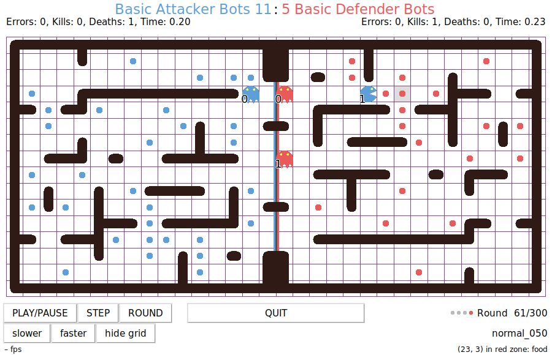
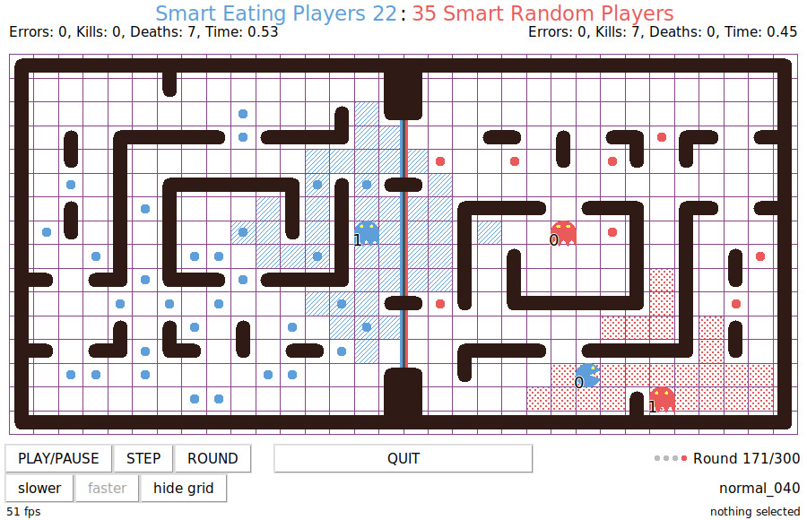

Pelita
======

## Table of contents
- [Pelita](#pelita)
  - [Table of contents](#table-of-contents)
- [Introduction](#introduction)
  - [Your task](#your-task)
  - [Content of this repository](#content-of-this-repository)
  - [Running a game](#running-a-game)
  - [Testing](#testing)
    - [Manual testing](#manual-testing)
    - [Unit testing](#unit-testing)
  - [Full API Description](#full-api-description)
    - [The maze](#the-maze)
    - [The `move` function](#the-move-function)
    - [The `Bot` object](#the-bot-object)
    - [Running multiple games in the background](#running-multiple-games-in-the-background)

------------------------------------------------

Introduction
============


Pelita is a Pac-Man like game. Two teams each of two bots are placed in a maze with food pellets. The maze is split into two parts, the left one belongs to the team on the left (the blue team), the right one belongs to the team on the right (the red team). When a bot is in its own homezone it is a ghost. A ghost can defend its own food pellets by killing the enemies. When a bot is in its enemy's homezone it is a pac-man and can eat the enemy's food. The game is turn-based: one bot moves, the rules of the game are applied, a new state of the game is generated, the next bot moves. The first bot of the blue team moves first, then the first bot of the red team moves, then the second bot of the blue team, and finally the second bot of the read team. This defines a round. A standard game lasts at most 300 rounds.

The rules:

- **eating food**: when a bot eats a food pellet, the food pellet is permanently removed from the maze and **one point** is scored for the bot's team.

- **killing enemies**: when a ghost kills an enemy pac-man, the killed pac-man is immediately reset to its starting position and **5 points** are scored for the ghost's team.

- **enemy position**: bots can know their enemies' exact positions only when the enemies are within a distance of **5** squares. If the enemies are further away than that, the bots have access only to a noisy position (more details [below](#is-noisy)).

- **timeouts**: each bot has **3** seconds to return a valid move. If it doesn't return in time a random legal move is executed instead and an error is recorded.

- **illegal moves**: if a bot returns an illegal move, a random legal move is executed instead and an error is recorded.

- **errors**: each team can commit a maximum of 4 errors. At the 5th error the team is disqualified and the game is over. Errors are either illegal moves or timeouts.

- **fatal errors**: if a bot raises an Exception, the team is immediately disqualified and the game is over.

- **game over**: the game ends when one team eats all of its enemy's food pellets **or** after **300** rounds **or** if a team is disqualified.

- **the winner**: the team with the highest score after game over wins the game, regardless of which team finished the food. A team also wins if the opponent team is disqualified, regardless of the score.

## Your task

Your task as a group is to write a bot implementation. You have to implement the *intelligence* to navigate your bots successfully
through the maze, kill the enemy's pac-men, and eat the enemy's food. You can find a minimal implementation in the [demo01_stopping.py](demo01_stopping.py) file:
```python
TEAM_NAME = 'StoppingBots'

def move(bot, state):
    next_pos = bot.position
    return next_pos
```
As seen above, your implementation consists of a team name (the `TEAM_NAME` string) and a function `move`, which given a bot and a state returns the next position for current bot. Don't panic right now, in the [Full API Description](#full-api-description) section you'll find all the details.

## Content of this repository
In this repository you will find several demo implementations (all files named `demoXX_XXX.py`), that you can use as a starting point for your own implementations. The files named  `test_demoXX_XXX.py` are example unit tests for some of the demo bot implementations. You can run the tests within a clone of this repo with `pytest` by typing:
```bash
$ python -m pytest
```
## Running a game
- To run a demo game, just type at the command line:
    ```bash
    $ pelita
    ```
- To test a demo implementation against another one:
    ```bash
    $ pelita demo03_smartrandom.py demo05_basic_defender.py
    ```
More info about the command `pelita` [below](#manual-testing)

## Testing
There are several strategies to test your bot implementations.

### Manual testing
You can test an implementation by playing against some of the demo implementations or against itself.

You can pass several options to the `pelita` command to help you with testing.

- **`--seed SEED`** you can pass the `--seed` option to the `pelita` command to repeat a game using the same random seed. The random seed for a game is printed on standard output:
    ```bash
    $ pelita demo03_smartrandom.py demo02_random.py
    Replay this game with --seed 7487886765553999309
    Using layout 'nomral_018'
    ᗧ blue team 'demo03_smartrandom.py' -> 'SmartRandomBots'
    ᗧ red team 'demo02_random.py' -> 'RandomBots'
    ...
    ```
    You can replay this exact game:
    ```bash
    $ pelita --seed 7487886765553999309 demo03_smartrandom.py demo02_random.py
    ...
    ```

- **`--stop-at ROUND`** you can pass the `--stop-at` option to the `pelita` command to stop a game at a specific round. You can then, for example, show the grid, play the next turns step by step, etc.

- selecting a specific square in the grid will show its coordinates and if the square is a wall or contains food or bots are sitting on it:
    

- **`--null`** you can pass the option `--null` to the `pelita` command to suppress the graphical interface and just let the game play in the background. This is useful if you want to play many games and just look at their outcome, for example to gather statistics. (A better strategy to play games in the background is shown in [demo10_background_games.py](demo10_background_games.py)).

- **`--ascii`** you can pass the option `--ascii` to the `pelita` command to  suppress the graphical interface and instead use a textual visualization in the terminal, which contains a lot of useful debug info.

- **`--progress`** similar to `--null` but showing the progress of the running game.

- **`--no-timeout`** you can pass the option `--no-timeout` to disable the timeout detection. This is useful for example if you want to run a debugger on your bot, like in [demo08_debugger.py](demo08_debugger.py)

- **`--help`** the full list of supported options can be obtained by passing `--help`.

### Unit testing
You should write unit tests to test your utility functions and to test your bot implementations. It is quite hard to test a full strategy, especially because you can not have a real opponent in a test game. It is useful to focus on specific situations (called `layouts`) and verify that your bot is doing the right thing. More info about layouts in the [Layouts](#layouts) section.

Several examples for unit testing are available in this repo in the files named `test_XXX.py`. If you name your test files starting with `test_` your tests will be automatically picked up by `pytest` when you run on the console in the directory where you cloned this repo:
```bash
$ python -m pytest
```
An example unit test could look like this:
```python
def test_stays_there_builtin_random_layout():
    # Using a random builtin layout, verify that the bot stays on its initial position
    bot = setup_test_game(layout=None, is_blue=True)
    next_pos = move(bot, {})
    # check that we did not move
    assert next_pos == bot.position
```

For setting up test games there is a utility function you can import from the `pelita.utils` module:

**`setup_test_game(layout, is_blue=True, round=None, score=None, seed=None, food=None, bots=None, enemy=None, is_noisy=None) ⟶ bot`**

Given a layout, returns a [Bot](#the-bot-object) that you can pass to the [move](#the-move-function) function.

The blue team's homezone is always on the left and the red team's homezone is always on the right. In the `setup_test_game` function you can pass `is_blue` which defines which side you are currently playing on.

The full documentation for the `setup_test_game` function can be read in its docstring:
```bash
$ python
>>> from pelita.utils import setup_test_game
>>> help(setup_test_game)
>>> ...
```


## Layouts
When you play a game using the command `pelita` without specifying a specific layout with the `--layout` option, one of the built-in layouts will be picked at random. The name of the used layout is seen in the lower right corner of the GUI and it is also print to the terminal:
```bash
$ pelita
Replay this game with --seed 354761256309345545
Using layout 'normal_035'
```

When you run your own games or write tests, you may want to play a game on a fixed layout. You can do that by specifying the option `--layout normal_035` to the `pelita` command, or passing `layout="normal_035"` to `setup_test_game`.

You may also want to specify very simple layouts to test some basic features of your bot that require you to know exactly where the walls, the enemies and the food are. In this case you can pass to `setup_test_game` a layout string. There are several examples of layout strings in the demo tests. 

Printing a `Bot` instance by inserting `print(bot)` within your `move` function will print the layout string corresponding to the current layout. An example:
```
################################
#. .#.   #  .  ##          .?  #
#   #     .#..      ..         #
#   #   ####      ########.  # #
#   #  .#.  .  ##   #       .  #
#   ## ##  # . ##. .# ###### # #
#.# #   #..#        #      # #.#
#.#.#...# . .    . ##  #       #
#       #  ## .    . . #...#.#.#
#.# #      #        #..#   # #.#
# # ###### #. .## . #  ## ##   #
#  .       #   ##  .  .#.  #   #
# #  .########      ####   #   #
#0  E     ..      ..#.     #   #
#1  .          ##  .  #   .#. .#
################################
```

The walls are identified by `#`, the food by `.`, your bots are `0` and `1`, the enemies are either `?`  or `E` depending if the enemy positions are noisy or exact (more details [below](#is-noisy)).

You can create smaller mazes, which are easier to test with and can be typed directly into the tests. For example a maze `8x4` with our bots in `(1, 1)` and `(1, 2)`, where the enemies are on `(5,2)` and `(6,2)` and food pellets in `(2, 2)` and `(6,1)`, and an additional wall in `(4,1)` will look like this:
```python
layout="""
########
#0  # .#
#1.  EE#
########
"""
```
In case some objects are overlapping (for example you want to locate an enemy bot over a food pellet) you can pass a partial layout and specify the positions of the objects in a list of coordinates to `setup_test_game`. For example:
```python

def test_print_stuff():
    layout="""
    ########
    #   #  #
    #.. ...#
    ########
    """
    bot = setup_test_game(layout, bots=[(1,1), (1,2)], enemy=[(5,2), (6,2)])
    print(bot)
```
Save this into a file `test_test.py`. When you run this test with `python -m pytest -s test_test.py` you get:
```bash
...

test_test.py blue (you) vs red.
Playing on blue side. Current turn: 0. Round: None, score: 0:0. timeouts: 0:0
########
#   #  #
#.. ...#
########
########
#0  #  #
#1   EE#
########
...
```
Notice that when there are overlapping object, two or more layouts will be printed. The effective layout is the one obtained by overlapping all of the partial layouts.

Notice that we have to pass the option `-s` to `pytest` so that it shows what we print. By default `pytest` swallows everything that gets printed to standard output and standard error on the terminal. 

## Full API Description

### The maze
The maze is a grid. Each square in the grid is defined by its coordinates. The default width of the maze is `32` squares, the default height is `16` squares. The coordinate system has the origin `(0, 0)` in the top left (North-West) of the maze and its maximum value `(31, 15)` in the bottom right (South-East). Each square which is not a wall can be empty or contain a food pellet or one or more bots. The different mazes are called `layouts`. For the tournament all layouts will have the default values for width and height and will have a wall on all squares around the border.

### The `move` function
**`move(bot, state) ⟶ (x, y)`**

The `move` function gets two input arguments:

- **`bot`** is a reference to the bot in your team corresponding to the current turn. It is an instance of the [`Bot` object](#the-bot-object), which contains all information about the current state of the game

- **`state`** points to a dictionary which can be used to hold state between rounds. It is intially empty when the game starts, and the `move` function can store whatever it wants in it.

Example of usage for `state` can be found in [demo04_basic_attacker.py](demo04_basic_attacker.py), [demo05_basic_defender.py](demo05_basic_defender.py), [demo06_one_and_one.py](demo06_one_and_one.py):
    ```python
    def move(bot, state):
        state['something_to_remember'] = 'an important string'
        return bot.position
    ```
    The `state` object will be passed untouched to the move function at every turn.

The `move` function returns the position to move the bot to in the current turn. The position is a tuple of two integers `(x, y)`, which are the coordinates on the game grid.

Note that the returned value must represent a legal position, i.e. you can not move your bot onto a wall or outside of the maze. If you return an illegal position, a legal position will be chosen at random instead and an error will be recorded for your team. After 5 errors the game is over and you lose the game.

### The `Bot` object
Note that the `Bot` object is read-only, i.e. any modifications you make to that object within the `move` function will be discarded at the next round. Use the `state` object for keeping state between rounds.

- **`bot.turn`** is the turn this bot is playing, either `0` or `1`.

- **`bot.other`** is the other bot in your team. It is a reference to a `Bot` object.

- **`bot.position`** is a tuple of the coordinates your bot is on at the moment. For example `(3, 9)`.

- **`bot.legal_positions`** is a list of positions your bot can take in the current turn without hitting a wall. At each turn the bot can move by one square in the grid, either horizontally or vertically, if the target square is not a wall. Note that the bot can always stay steady, i.e. you can let your `move` function return `bot.position`.

- **`bot.walls`** is a list of the coordinates of the walls in the maze:
    ```python
    [(0, 0), (1, 0), (2, 0), ..., (29, 15), (30, 15), (31, 15)]
    ```
    so, if for example you want to test if position `(3, 9)` in the maze is a wall, you can do:
    ```python
    (3, 9) in bot.walls
    ```
    
    The maze can be represented as a graph. If you want to use [networkx](https://networkx.github.io) for shortest path algorithms, you can use the `walls_to_graph` function in `pelita.utils`.

    Examples for using a graph representation for shortest path calculations can be found in [demo04_basic_attacker.py](demo04_basic_attacker.py) and [demo05_basic_defender.py](demo05_basic_defender.py).

- **`bot.homezone`** is a list of all the coordinates of your side of the maze, so if for example you are the red team in a `32×16` maze, your homezone will be:
    ```python
    [(16, 0), (16, 1), (16, 2), (16, 3), ..., (31, 13), (31, 14), (31, 15)]
    ```
    as with `bot.walls` you can test if position `(3, 9)` is in your homezone with
    ```python
    (3, 9) in bot.homezone
    ```
    You can check if you got assigned the blue team – your homezone is the left side of the maze – with **`bot.is_blue`**. Otherwise you are the red team and your homezone is the right side of the maze. The blue team always plays the first move.

- **`bot.food`** is the list of the coordinates of the food pellets in your own homezone
    ```python
    [(17, 8), (24, 8), (17, 7), ...]
    ```
    as soon as the enemy will start eating your food pellets this list will shorten up!


- **`bot.track`** is a list of the coordinates of the positions that the bot has taken until now. It gets reset every time the bot gets killed by an enemy ghost. When you are killed, the property **`bot.was_killed`** is set to `True` until the next round.

- **`bot.score`** and **`bot.round`** tell you the score of your team and the round you are playing.

- **`bot.random`** is an instance of the Python internal pseudo-random number generator. Do not import the Python `random` module in your code, just use this for all your random operations. Example of using it are found in [demo02_random.py](demo02_random.py), [demo03_smartrandom.py](demo03_smartrandom.py), and several others. If you need to use the `numpy` random module, initialize it with a seed taken from this instance like this:
    ```python
    np.random.seed(bot.random.randint(0, 2**32-1))
    ```
    Note that you want to do it only **once** per game!

- **`bot.error_count`** is a count of the error your team has got. Remember that if you commit 5 errors you lose the game, independent of the score. Errors are either timeouts (it takes longer than 3 seconds to execute your `move` function) or illegal positions returned by your `move` function.

- **`bot.say(text)`** allows you to print `text` as a sort of speech bubble attached to your bot in the graphical user interface.

- **`bot.kills`** is the number of enemy bots your bots has killed until now.

- **`bot.deaths`** is the number of times your bot has been killed until now.

- **`bot.enemy`** is a list containing the references to the two enemy bots, which are also `Bot` objects, so they have all the properties we have just seen above. So, for example the position of the first enemy bot:
    ```python
    bot.enemy[0].position
    ```
    This position may be not exact (see below the `is_noisy` property).

- **`bot.enemy[0].food`** is the list of coordinates of the food pellets you want to eat.

- **`bot.enemy[0].team_name`** you can also inspect the enemy team name with `bot.enemy[0].team_name`.

- **`bot.enemy[0].is_noisy`**  <a id="is-noisy"></a> your bot has a sight-radius of 5 squares. This means that when an enemy bot is located more than 5 squares away from your bot, `bot.enemy[0].position` will not be exact and `bot.enemy[0].is_noisy` will be `True`. The sight-radius for red bot 1 is the red-dotted area in the picture below. Red bot 1 will see the exact position of blue bot 0, because it falls into its sight-radius. Instead, red bot 1 will see blue bot 1 as if it were located in one random legal position up to 5 squares away from its true position (this is the noise-radius, the blue-striped area around blue bot 1 in the picture). An example of using the `is_noisy` property is given in [demo05_basic_defender.py](demo05_basic_defender.py).



### Running multiple games in the background
You may want to run multiple games in the background to gather statistics about your implementation,
or to fit some parameters of your implementation. The script [demo10_background_games.py](demo10_background_games.py) is an example of this. You can run it like this:
```bash
python demo10_background_games.py
```
