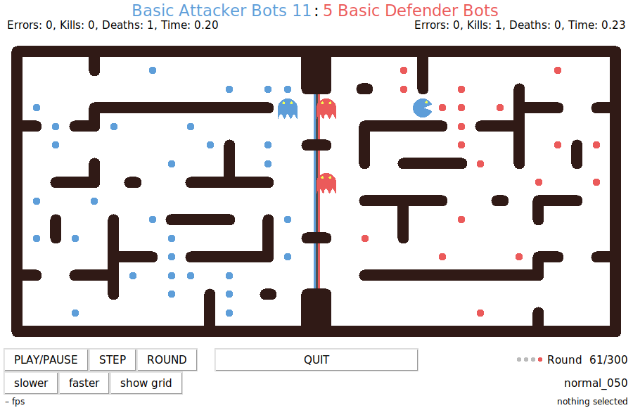

Pelita
======

## Table of contents
- [Introduction](#introduction)
- [Your task](#your-task)
- [Content of this repository](#content-of-this-repository)
- [Running a game](#running-a-game)
- [Testing](#testing)
  - [Manual testing](#manual-testing)
  - [Unit testing](#unit-testing)
- [Full API description](#full-api-description)
  - [The maze](#the-maze)
  - [The `move` function](#the-move-function)
  - [The `Game` object](#the-game-object)
  - [The `Bot` object](#the-bot-object)

------------------------------------------------

Introduction
============


Pelita is a PacMan™ like game. Two teams each of two bots are placed in a maze with food pellets. The maze is split into two parts, the left one belongs to the team on the left (the blue team), the right one belongs to the team on the right (the red team). When a bot is in its own homezone it is a ghost. A ghost can defend its own food pellets by killing the enemies. When a bot is in its enemy's homezone it is a pacman and can eat the enemy's food. The rules:

- **eating food**: when a bot eats a food pellet, the food pellet is permanently removed from the maze and **one point** is scored for the bot's team

- **eating enemies**: when a ghost eats an enemy pacman, the eaten pacman is immediately reset to its starting position and **5 points** are scored for the ghost's team

- **observation**: bots can see their enemies' positions only when the enemies are within a distance of **5** squares. If the enemies are further away than that, their position is noisy (more details [below](#is-noisy)).

- **timeout**: each bot has **3** seconds to return a valid move. If it doesn't return in time or if the move returned is illegal, a random move is executed instead and a timeout is recorded. After 5 timeouts the team is disqualified and loses the game.

- **game over**: the game ends when one team eats all of its enemy's food pellets or after **300** rounds.

- **winning**: the team with the highest score after game over wins the game, regardless of which team finished the food.

## Your task

Your task as a group is to write a bot implementation. You have to implement the *intelligence* to navigate your bots successfully
through the maze, kill the enemy's pacmen, and eat the enemy's food. You can find a minimal implementation in the [demo01_stopping.py](demo01_stopping.py) file:
```python
TEAM_NAME = 'StoppingBots'

def move(turn, game):
    return (0,0)
```
As seen above, your implementation consists of a team name (the `TEAM_NAME` string) and a function `move`, which given a turn and a game state returns a move for the bot. In the [Full API Description](#full-api-description) section you'll find all the details.

## Content of this repository
In this repository you will find several demo implementations (all files named `demoXX_XXX.py`), that you can use as a starting point for your own implementations. There is also an example `utils.py` module and a series of unit tests for the demo implementations (all files named `test_demoXX_XXX.py`). You can run the tests with `pytest` by typing:
```bash
$ python3 -m pytest
```
## Running a game
- To run a demo game, just type at the command line:
    ```bash
    $ pelita
    ```
- To test a demo implementation against another one:
    ```bash
    $ pelita demo03_smartrandom.py demo05_basic_defender.py
    ```
More info about the command `pelita` [below](#manual-testing)

## Testing
There are several strategies to test your bot implementations.

### Manual testing
The `pelita` command has several features to help you with testing.
- **`--seed SEED`** you can pass the `--seed` option to the `pelita` command to repeat a game using the same random seed. The random seed for a game is printed on standard output:
    ```bash
    $ pelita demo03_smartrandom.py demo02_random.py
    Replay this game with --seed 7487886765553999309
    Using layout 'layout_normal_without_dead_ends_033'
    Blue team 'demo03_smartrandom.py' -> 'SmartRandomBots'
    Red team 'demo02_random.py' -> 'RandomBots'
    ...
    ```
    You can replay this exact game:
    ```bash
    $ pelita --seed 7487886765553999309 demo03_smartrandom.py demo02_random.py
    ...
    ```

- **`--stop-at ROUND`** you can pass the `--stop-at` option to the `pelita` command to stop a game at a specific round. You can then, for example, show the grid, play the next turns step by step, etc.

- selecting a specific square in the grid will show its coordinates and if the square is a wall or contains food or bots:
    

- **`--null`** you can pass the option `--null` to suppress the graphical interface and just let the game play in the background. This is useful if you want to play many games and just look at their outcome, for example to gather statistics.

- **`--no-timeout`** you can pass the option `--no-timeout` to disable the timeout detection. This is useful for example if you want to run a debugger on your bot, like in [demo08_debugger.py](demo08_debugger.py)

- **`--help`** the full list of supported options can be obtained by passing `--help`.
    
### Unit testing
You should write unit tests to test your utility functions and to test your bot implementations. It is quite hard to test a full strategy, especially because you can not have a real opponent in a test game. It is useful to focus on specific situations (called `layouts`) and verify that your bot is doing the right thing. Several examples are available in this repo in the files named `test_XXX.py`. If you name your test files starting with `test_` your tests will be automatically picked up by `pytest` when you run on the console:
```bash
$ python3 -m pytest
```
An example unit test could look like this:
```python
from demo01_stopping import move
from pelita.utils import setup_test_game

def test_stays_there():
    layout="""
    ########
    #0    .#
    #.1  EE#
    ########
    """
    game = setup_test_game(layout=layout, is_blue=True)
    next_move = move(0, game)
    assert next_move == (0,0)
```

For setting up test games there is a utility function you can import from `pelita.utils`:

```python
setup_test_game(layout=layout, is_blue=True, round=None, score=None, seed=None, food=None, bots=None, enemy=None) ⟶ game
```

Given a layout string, returns a [Game](#the-game-object) instance suitable to be passed to a [move](#the-move-function) function. Printing a `Game` object will print its layout string. In the simplest form a layout string is a multiline string where the character `#` identifies walls, `.` the food pellets, `E` the enemy bots (you must have two of them for a layout to be legal), and `0` and `1` representing the bots in your team corresponding to turn `0` and `1`.

For example a maze `8x4` with our bots in `(1, 1)` and `(1, 2)`, where the enemies are on `(5,2)` and `(6,2)` and food pellets in `(2, 2)` and `(6,1)`, and an additional wall in `(4,1)` will look like this:
```python
layout="""
########
#0  # .#
#1.  EE#
########
"""
```
In case some objects are overlapping (for example you want to locate an enemy bot over a food pellet), you can either specify several layouts in the same multiline strings, each containing a partial layout, like this:
```python
layout="""
########
#0. # .#
#1.  EE#
########
 
########
#   #  #
#     .#
########
"""
```
You can also pass a partial layout and specify the positions of the objects in a list of coordinates. For example:
```python
layout="""
########
#   #  #
#   .  #
########
"""
game = setup_test_game(layout, bots=[(1,1), (1,2)], enemy=[(5,2), (6,2)])
print(game)
########
#   #  #
#   .  #
########
 
########
#0  #  #
#1   EE#
########
```
If you notice a certain configuration in a game that you want to replicate in a test, you can print the game in your move function and then use the output string as a layout in a test. For example, you could have the following move function:
```python
def move(turn, game):
    bot = game.team[turn]
    # print initial state
    if turn == 0 and bot.round == 0:
        print(game)
    ...
    return (0, 0)
```
Running this bot will print the following string on standard output:
```
################################
# .  #  . .. ..         .      #
#.   . .###### ##.. ##### ## # #
#      .    .# ## . #  #   #   #
# # ##..   . #.      .   . # # #
#.#  #### ##     .########   # #
#      .  .       .    # ..  # #
## ######. ## ###         .#   #
#   #.         ### ## .###### ##
# #  .. #    .       .  .      #
# #   ########.     ## ####  #.#
# # # .   .      .# .   ..## # #
#   #   #  # . ## #.    .      #
# # ## ##### ..## ######. .   .#
#      .         .. .. .  #  . #
################################

################################
#    #                        1#
#       ###### ##   ##### ## #0#
#            # ##   #  #   #   #
# # ##       #             # # #
# #  #### ##      ########   # #
#                      #     # #
## ######  ## ###          #   #
#   #          ### ##  ###### ##
#E#     #                      #
# #E  ########      ## ####  # #
# # #             #       ## # #
#   #   #  #   ## #            #
# # ## #####   ## ######       #
#                         #    #
################################
```
Now you can copy and paste this string in a test, pass it to `setup_test_game` and verify that your bot returns the move you were expecting.


## Full API Description

### The maze
The maze is a grid. Each square in the grid is defined by its coordinates. The default width of the maze is `32` squares, the default height is `16` squares. The coordinate system has the origin `(0, 0)` in the top left (North-West) of the maze and its maximum value `(31, 15)` in the bottom right (South-East). Each square which is not a wall can be empty or contain a food pellet or one or more bots. The different mazes are called `layouts`. You can get a list of all available layouts with 

```bash
$ pelita --list-layouts
```
 For the tournament only layouts without dead ends will be used and all layouts will have the default values for width and height. Additionally, all layouts will have a wall on all squares around the border.

### The `move` function
**`move(turn, game) ⟶ (dx, dy)`**

The `move` function gets two input arguments:

- **`turn`** is the turn in the current round, i.e. `turn` is either `0` for the first bot in your team or `1` for the second one.

- **`game`** is a reference to the current game state. It is an instance of the [`Game` object](#the-game-object), which contains all information about the current state of the game

The `move` function returns a move for the bot in your team corresponding to the current turn. The move is a tuple of two integers `(dx, dy)`, which can be:

- **`(1, 0)`** for moving to the right (East)
- **`(-1, 0)`** for moving to the left (West)
- **`(0, 1)`** for moving down (South)
- **`(0, -1)`** for moving up (North)
- **`(0, 0)`** for stopping (no move)

Note that the returned move must be a legal move, i.e. you can not move your bot on a wall. If you return an illegal move, a random move will be executed instead and a timeout will be recorded for your team. After 5 timeouts the game is over and you lose the game. 

### The `Game` object

- **`game.team`** is a list of the two [`Bot` objects](#the-bot-object) in your team:
    ```python
    bot0 = game.team[0]  # the first bot in your team
    bot1 = game.team[1]  # the second bot in your team
    ```
    Within the `move` function, you can identify the bot whose move you have to return in the current turn by using the index `turn`. Since there are only two bots in your team, you can access your teammate with `1 - turn`:
    ```python
    def move(turn, game):
        bot = game.team[turn]  # the bot that performs the next move
        teammate = game.team[1 - turn]  # the other bot in our team
        ...
        return next_move
    ```


- **`game.state`** is a reference to an arbitrary object, `None` by default, which can be used to hold state between rounds. Example of usage for `game.state` can be found in [demo04_basic_attacker.py](demo04_basic_attacker.py), [demo05_basic_defender.py](demo05_basic_defender.py), [demo06_one_and_one.py](demo06_one_and_one.py):
    ```python
    def move(turn, game):
        bot = game.team[turn]
        if game.state is None:
            # initialize an empty dictionary to keep information we
            # want to share within our team during the game
            # -> both bots will have access to this dictionary
            game.state = {}
        ...
        return next_move
    ```

Note that, except for `game.state`, the `Game` object is read-only, i.e. you can not modify it within the `move` function.

### The `Bot` object

- **`bot.position`** is a tuple of the coordinates your bot is on at the moment. For example `(3, 9)`.

- **`bot.legal_moves`** is a list of moves your bot can make without hitting a wall. Note that not moving, i.e. `(0, 0)` is always a legal move.

- **`bot.walls`** is a list of the coordinates of the walls in the maze: 
    ```python
    [(0, 0), (1, 0), (2, 0), ..., (29, 15), (30, 15), (31, 15)]
    ```
    so, if for example you want to test if position `(3, 9)` in the maze is a wall, you can do:
    ```python
    (3, 9) in bot.walls
    ```
    The maze can be represented as a graph. Pelita has its own minimal implementation of a graph, which offers
    a couple of short-path algorithm implementations. The maze can be converted to a graph with
    ```python
    from pelita.utils import Graph
    
    graph = Graph(bot.position, bot.walls)
    ```
    Example usage of `Graph` can be found in [demo05_basic_defender.py](demo05_basic_defender.py). More advanced graph features can be obtained by converting the maze to a [networkx](https://networkx.github.io/) graph. For this you can use the `walls_to_nxgraph` function in [utils.py](utils.py)

- **`bot.homezone`** is a list of all the coordinates of your side of the maze, so if for example you are the red team in a `32×16` maze, your homezone will be:
    ```python
    [(16, 0), (16, 1), (16, 2), (16, 3), ..., (31, 13), (31, 14), (31, 15)]
    ```
    as with `bot.walls` you can test if position `(3, 9)` is in your homezone with
    ```python
    (3, 9) in bot.homezone
    ```
    You can check if you got assigned the blue team – your homezone is the left side of the maze – with **`bot.is_blue`**. Otherwise you are the red team and your homezone is the right side of the maze. The blue team plays the first move.

- **`bot.food`** is the list of the coordinates of the food pellets in your own homezone
    ```python
    [(17, 8), (24, 8), (17, 7), ...]
    ```
    as soon as the enemy will start eating your food pellets this list will shorten up!


- **`bot.track`** is a list of the coordinates of the positions that the bot has taken until now. It gets reset every time the bot gets eaten by an enemy ghost. When you are eaten, the property **`bot.eaten`** is set to `True` until the next round.

- **`bot.score`** and **`bot.round`** tell you the score of your team and the round you are playing.

- **`bot.get_move(next_position) ⟶ (dx, dy)`** is a method of the `Bot` object which gives you the move `(dx, dy)` you have to make to get to the position `next_position`. If `next_position` can not be reached with a legal move you'll get a `ValueError`.

- **`bot.get_position(next_move) ⟶ (x, y)`** is a method of the `Bot` object which gives you the position `(x, y)` you will have if you execute the move `next_move`. If `next_move` is not a legal move you'll get a `ValueError`

- **`bot.random`** is an instance of the Python internal pseudo-random number generator. Do not import the Python `random` module in your code, just use this for all your random operations. Example of using it are found in [demo02_random.py](demo02_random.py), [demo03_smartrandom.py](demo03_smartrandom.py), and several others. If you need to use the `numpy` random module, initialize it with a seed taken from this instance like this:
    ```python
    np.random.seed(bot.random.randint(0, 2**32-1))
    ```
    Note that you want to do it only **once** per game!

- **`bot.timeout_count`** is a count of the timeouts your team has got. Remember that after 5 timeouts you lose the game, independent of the score.

- **`bot.say(text)`** allows you to print `text` as a sort of speech bubble attached to your bot in the graphical user interface.

- **`bot.enemy`** is a list containing the references to the two enemy bots, which are also `Bot` objects, so they have all the properties we have just seen above. So, for example the position of the first enemy bot:
    ```python
    bot.enemy[0].position
    ```
    This position may be not exact (see below the `is_noisy` property).

- **`bot.enemy[0].is_noisy`** <a id="is-noisy"></a> if the enemy bot is located more than 5 squares away from your bot, then its position `bot.enemy[0].position` will not be exact. A uniformly distributed noise between `-5` and `+5` squares will be added to it instead. The distance of your bot from the enemy bot is measured in grid space, i.e. if your bot is in `(Bx, By)` and the enemy bot is in `(Ex, Ey)`, the distance will be `abs(Bx-Ex) + abs(By-Ey)`. An example of using the `is_noisy` property is given in [demo05_basic_defender.py](demo05_basic_defender.py).

- **`bot.enemy[0].team_name`** you can also inspect the enemy team name with `bot.enemy[0].team_name`.

Note that the `Bot` object is read-only, i.e. you can not modify it within the `move` function.
